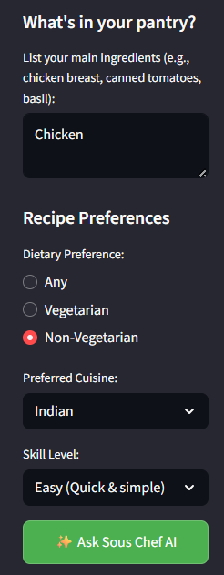
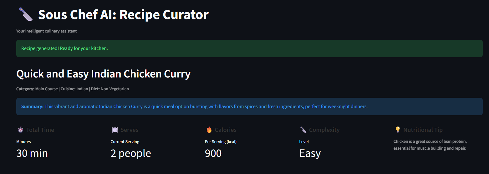
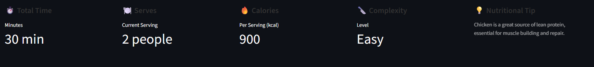
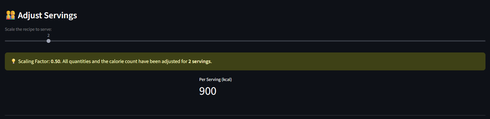
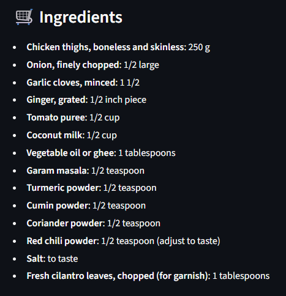
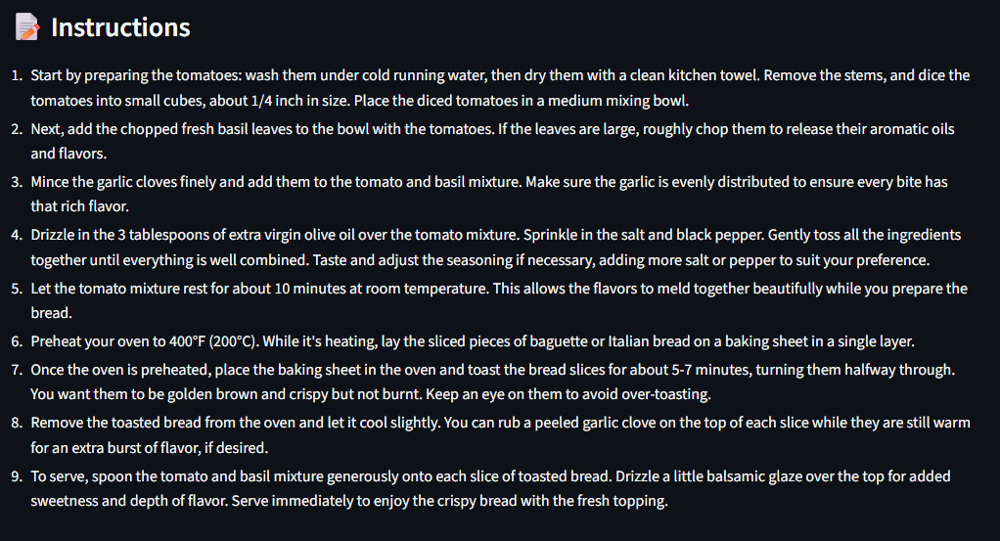
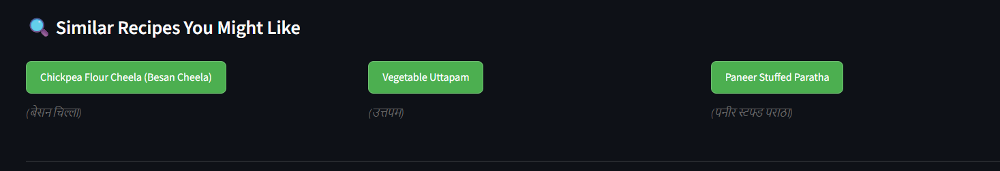

# 🔪 Sous Chef AI: Structured Recipe Curator

**Sous Chef AI** is an intelligent, interactive web application built with **Streamlit** and **LangChain**. It leverages the power of OpenAI's LLMs to generate high-quality, perfectly structured cooking recipes based on user-defined ingredients, cuisine, and dietary preferences.

The core innovation is using **LangChain's structured output capabilities** combined with **Pydantic schemas** to guarantee the LLM's response is a valid, usable JSON object, making the application robust and reliable.

---

## ✨ Key Features

- **Structured Recipe Output**  
  Uses Pydantic to enforce a strict Recipe data structure, including fields for instructions, ingredients, metadata, and nutritional facts. This eliminates typical LLM output inconsistencies.

- **Dynamic Quantity Scaling**  
  Adjust a slider to change the number of servings. Ingredients are automatically recalculated, intelligently handling fractions and units.

- **Contextual Recipe Suggestions**  
  Generates three similar recipe ideas from the same cuisine, including their local (native) names. Click to generate a new recipe immediately.

- **Enriched Metadata**  
  Each recipe includes a calculated caloric estimate per serving, a historical fact about the dish, and a nutritional tip.

- **User-Friendly UI**  
  Built with Streamlit for a clean, responsive, and intuitive interface.

---

## 🚀 Technologies Used

| Technology   | Purpose                                                        |
|-------------|----------------------------------------------------------------|
| Python      | Core programming language                                       |
| Streamlit   | Creates the responsive, interactive web application frontend   |
| LangChain   | Orchestrates prompt engineering and structured LLM calls       |
| OpenAI      | Provides the gpt-4o-mini model for text generation             |
| Pydantic    | Defines strict data models (schemas) for validated JSON output |
| os, re      | Handles environment variables and regex for quantity parsing  |

---

## ⚙️ Installation and Setup

### 1. Prerequisites
- Python 3.8+
- OpenAI API Key

### 2. Clone the Repository
```bash
git clone https://github.com/your-username/sous-chef-ai.git
cd sous-chef-ai
```
### 3. Create a Virtual Environment and Install Dependencies
```bash
# Create and activate environment
python -m venv venv
source venv/bin/activate  # Linux/macOS
venv\Scripts\activate     # Windows

# Install required packages
pip install -r requirements.txt
```
### 4.Configure Your API Key
```bash
# Linux/macOS
export OPENAI_API_KEY='YOUR_OPENAI_KEY_HERE'

# Windows (Command Prompt)
set OPENAI_API_KEY=YOUR_OPENAI_KEY_HERE # Replace YOUR_OPENAI_KEY_HERE with your actual key.
```

### 5.How to Run
```bash
streamlit run main.py
```

### 🍴 Usage Example

- Input Ingredients: In the sidebar, list your ingredients (e.g.,  chicken, mushrooms, cream, pasta).

- Select Preferences: Choose cuisine (e.g., Italian) and skill level (e.g., Medium).

- Generate Recipe: Click the ✨ Ask Sous Chef AI button.

- Interact: A structured recipe appears. Use the "Adjust Servings" slider to scale ingredients from 2 to 12 servings instantly.


## 🛠️ How It Works

  

1. **Input Ingredients:**  
   - In the sidebar, the user lists the main ingredients available in their pantry (e.g., chicken, tomatoes, basil).

2. **Select Dietary Preference:**  
   - Choose from **Any**, **Vegetarian**, or **Non-Vegetarian** options.

3. **Choose Cuisine:**  
   - Pick a preferred cuisine from the dropdown menu (e.g., Indian, Italian, Mexican).

4. **Select Skill Level:**  
   - Choose the desired difficulty level for the recipe (e.g., Easy, Medium, Advanced).

5. **Generate Recipe:**  
   - Click the **✨ Ask Sous Chef AI** button to send inputs to the LLM and receive a structured recipe.

6. **Recipe Presentation**
- Once the recipe is generated, the system presents the user with the following:
  - **Recipe Name**: The title of the recipe is shown at the top.
  - **Category**: The recipe’s category (e.g., Main Course).
  - **Cuisine Type**: The cuisine is specified (e.g., Indian).
  - **Diet Type**: The recommended diet type is displayed (e.g., Non-Vegetarian).
  - **Summary**: A brief description of the recipe is provided, describing its flavor, ingredients, and suitable occasions for serving.
       
  
7. **Recipe Metrics** 
- The application calculates and displays key recipe metrics:
  - **Total Time**: The time it takes to cook the recipe is shown in minutes.
  - **Serves**: The number of servings that the recipe yields, typically defaulting to 2 people.
  - **Calories**: The number of calories per serving, based on the chosen ingredients.
  - **Complexity**: The difficulty level of preparing the dish (e.g., Easy, Medium, Hard).
  - **Nutritional Tip**:Additional information about the health benefits of key ingredient, e.g, Chicken is a great source of lean protein, essential for muscle building and repair.
     
 
8. **Dynamic Quantity Adjuster:**
- Use the slider to adjust ingredient quantities based on the number of people (default: 2).
    

9. **Ingredient List** 
- Ingredients Panel: Displays all necessary ingredients in a clear, organized list.
        
10. **Instructions:**
- Provides clear, step-by-step guidance to prepare the dish.
    
11. **Similar Recipes You Might Like:** 
- Suggests recipes of a similar type for you to try.
    
    
